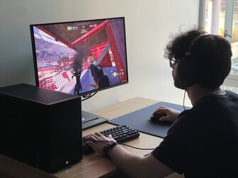

# Michael Awad


*A picture of me playing **THE FINALS** on my friend's setup*

## Introduction
My Name is Michael Awad and I am a third year transfer student studying Computer Science here at UCSD. 
I have experience with:

```python
print("Python")
printf("C");
std::cout << "C++";
System.out.println("Java");
console.log("JavaScript");
```

Outside of school, my hobbies include going to the gym, gaming, reading, photography, and just learning new things. 

[Linkedin](https://www.linkedin.com/in/michael-awad-314483297/)

(README.md)[README.md]

## Fun Fact
My favorite TV Show is New Girl and I have rewatcgit hed it an unhealthy amount of times.
My favorite quote from the show is:
> I'm not convinced I know how to read. I've just memorized a lot of words. - Nick Miller

## Classes
### CSE classes I've taken this year:
- CSE 21
- CSE 29
- CSE 30
- CSE 100
- CSE 101

### My top 3 CSE classes that I've taken this year:
1. CSE 29
2. CSE 101
3. CSE 30

### Some CSE classes I'm taking right now or want to take (ticked means im taking now):
- [x] CSE 110
- [ ] CSE 112
- [x] CSE 120
- [x] CSE 150B
- [ ] CSE 123
- [ ] CSE 125
- [ ] CSE 140

[Intro](#introduction)
[Fun Fact](#fun-fact)
[Classes](#classes)
[Back to top](#michael-awad)